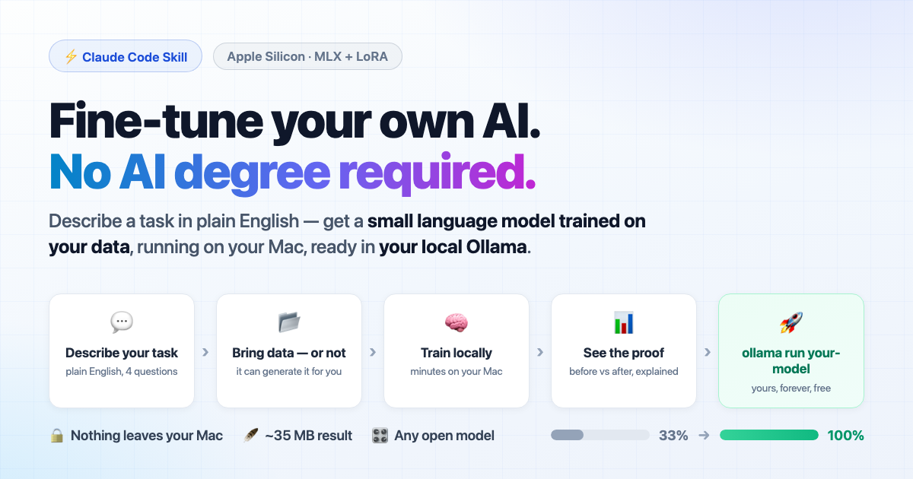
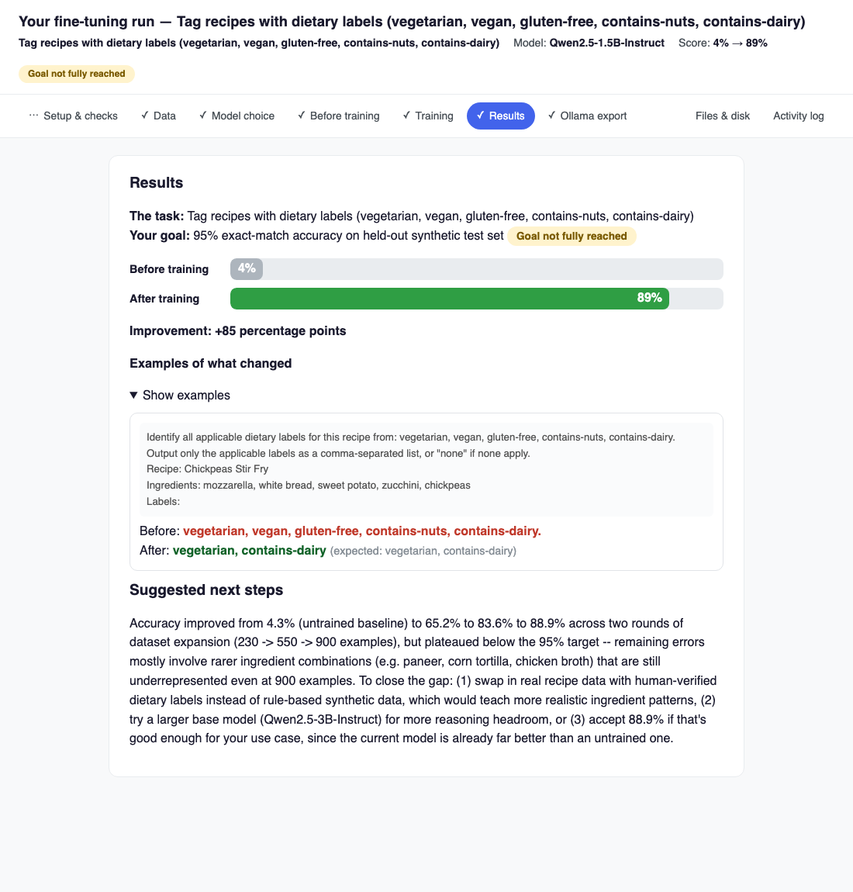
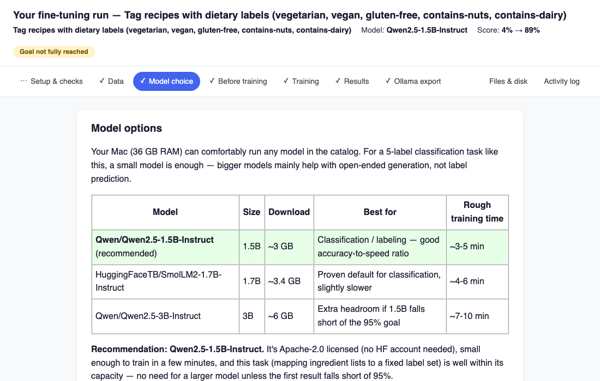
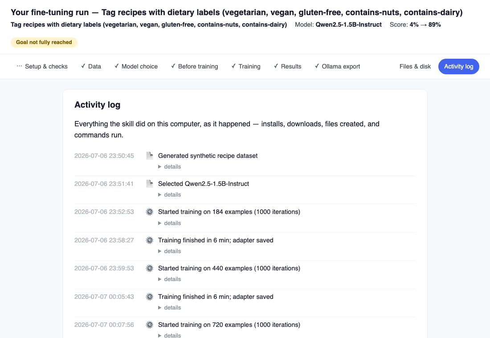
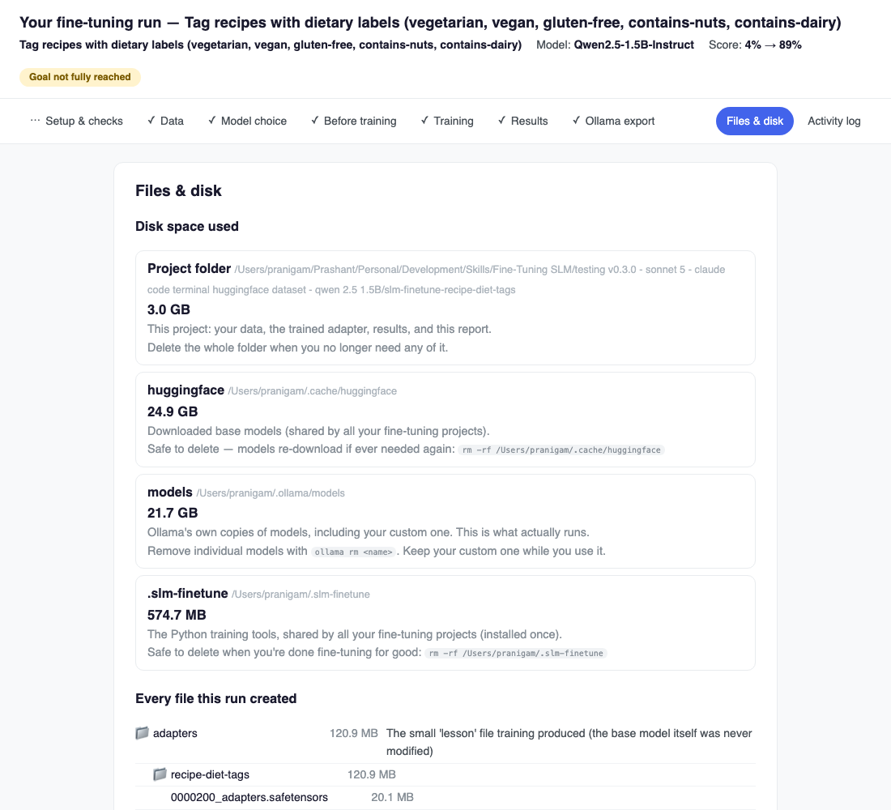
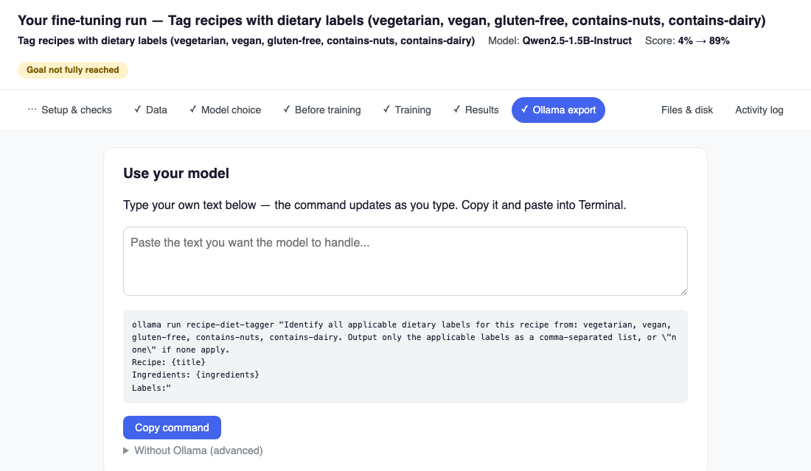

<div align="center">



# fine-tune-slm

**Describe a task in plain English. Get a small language model trained on your data, running on your Mac, ready in Ollama.**

[](#requirements)
[](https://github.com/ml-explore/mlx)
[](#does-it-work-outside-claude-code)
[](https://claude.com/claude-code)
[](LICENSE)

*You answer four plain-English questions. The skill does the AI engineering.*

</div>

---

## Why this exists

Fine-tuning a small language model is genuinely useful - a 1.5B model trained on **your** emails, tickets, or logs beats prompting a giant model at narrow tasks, costs nothing to run, and never sends a byte to the cloud. But doing it means environment setup, data formatting, hyperparameters, evaluation harnesses, overfitting diagnosis, model export…

This skill packages all of that engineering so that **anyone comfortable with a computer - not just ML engineers - can fine-tune locally.** You describe the task; it interviews you like a colleague, not a config file.

## What makes it different

| | |
|---|---|
| 🗣️ **Plain English, zero jargon** | Four questions: *What should it learn? Do you have examples? What does a perfect answer look like? How good must it be?* You never see a learning rate. |
| 🔒 **Radically private** | Training data, model, and every prediction stay on your Mac. The dashboard's disk view even shows you every file it created and how to delete it. |
| 🎛️ **Your choice of model** | Recommends from a vetted catalog (SmolLM2, Qwen2.5, Llama 3.2, Gemma, Phi, Mistral) sized to *your* RAM - and always lets you bring any Hugging Face model instead. |
| 🧪 **No data? No problem** | It generates realistic, diverse training examples for your task (you approve samples first), or downloads a public dataset from Hugging Face - with your consent, never silently. |
| 📊 **Proof, not vibes** | Tests the model *before* training, trains, tests again on held-out examples - and if the goal is missed, diagnoses *why* from the actual wrong answers and retrains with targeted fixes. |
| 🧾 **Full receipts** | One interactive HTML dashboard per run: a clickable pipeline of every stage, before/after scores, every file explained with sizes, and an activity log of every install, download, and command it ran on your machine. |

## What a run looks like

```
You:  "fine-tune a small model to sort my support emails into urgent / normal / low"

Skill:  ✓ Checks your Mac (chip, RAM, disk, Ollama)          - fails gracefully if unsupported
        ✓ Asks 4 plain-English questions                      - including your accuracy goal
        ✓ Prepares your data (or generates it)               - you review samples first
        ✓ Recommends a model that fits your hardware          - you pick, or bring your own
        ✓ Baseline test → LoRA training → final test          - minutes, on-device
        ✓ Misses the goal? Diagnoses and retrains - max twice - no infinite loops
        ✓ Installs into your local Ollama                     - on this Mac; published nowhere
        ✓ Hands you the dashboard                             - what happened, in plain language
```

## The dashboard - full receipts, in plain language

Every run produces one interactive dashboard. These screenshots are from a real run (recipe dietary tagging, Qwen2.5-1.5B) - including honest reporting when the 95% goal *wasn't* fully reached:

<div align="center">

<br><em>Results, before vs after (4% → 89%), an example the training fixed - and honest next steps when the goal isn't met.</em>
</div>

| | |
|---|---|
|  <p align="center"><em>Model options for <b>your</b> hardware, recommendation marked - or bring any Hugging Face model</em></p> |  <p align="center"><em>Activity log: everything the skill did on your machine, as it happened</em></p> |
|  <p align="center"><em>Every file explained, disk usage across all locations, and how to reclaim space</em></p> |  <p align="center"><em>Type your text, copy the ready-made command - your model, installed in <b>local</b> Ollama</em></p> |

## Quick start

```bash
git clone https://github.com/prashantnigam10/fine-tune-slm.git
cp -R fine-tune-slm/skills/fine-tune-slm ~/.claude/skills/
```

Then, in a Claude Code session, just say what you want:

> fine-tune a small model that tags my expenses from bank statement lines

No further setup. Dependencies install once into a shared, version-pinned environment (`~/.slm-finetune`) on your first run - later runs skip installation entirely, and base models are cached and reused across projects.

**Using another agent?** This is a portable [Agent Skill](#does-it-work-outside-claude-code) - nothing here is Claude-specific but the folder location. Point your agent's skill directory at the repo's `skills/fine-tune-slm`. For example, on Google Antigravity (validated), add the repo's `skills/` path to its skills registry; any Agent-Skills-compatible agent works the same way.

## What can you build?

| Everyday | Developer pipelines |
|---|---|
| 📧 Email triage (urgent / normal / low) | 📝 Commit messages from diffs - trained on your repo's own history |
| 💳 Expense categorizer - data that should *never* leave your Mac | 🏷️ PR & issue auto-labeling from your closed-issue history |
| 📋 Meeting notes → action items with owners | 🚦 CI failure triage: flaky vs real vs infra |
| ✍️ Rewrite drafts in your own email voice | 🧹 Review gatekeeper: only send non-trivial diffs to your expensive LLM |
| 📔 Journal mood & theme tagging | 🔐 Pre-flight secret/PII gate before anything goes to a cloud API |
| 🍳 Recipe dietary tags - no data needed, it generates them | 📊 Alerts & tickets → clean JSON for dashboards |

The pattern for the developer column: a fine-tuned local model handles the high-volume, narrow work at $0 per call; your frontier model only sees what actually needs it.

## Real results

From the runs this skill was built and validated on (MacBook Pro, Apple Silicon):

- **Email sentiment** - SmolLM2-1.7B: **33% → 100%** on held-out test after a ~5-minute LoRA fine-tune; adapter size ~21 MB
- **Recipe dietary tagging** (multi-label, harder) - Qwen2.5-1.5B: the skill *detected overfitting from validation loss, compared checkpoints, generated targeted synthetic examples for the failing categories, and retrained* - automatically
- The original tutorial project this grew from: **62% → 99.1%** ([7-part series on dev.to](https://dev.to/prashant/small-language-model-sml-the-future-of-local-ai-part-1-3dp6))

## How it works under the hood

Deterministic scripts do the heavy lifting; the AI does the judgment. That split is deliberate - everything scripted behaves identically on every run.

```
skills/fine-tune-slm/
├── SKILL.md              the workflow the agent follows
├── requirements.txt      pinned, tested-together dependency set
├── scripts/
│   ├── preflight.py      hardware/env checks + model-cache detection
│   ├── prepare_data.py   any format → training format, dedupe, split
│   ├── train.py          LoRA via MLX; always records metadata; OOM & overfit hints
│   ├── evaluate.py       held-out testing, per-label breakdowns
│   └── dashboard.py      the single-file HTML dashboard (pipeline, results, files, activity log)
└── references/           model catalog · data formats · synthetic data rules ·
                          Ollama export · troubleshooting
```

Training uses [LoRA](https://arxiv.org/abs/2106.09685) - the base model stays frozen; a small adapter (~20–35 MB) learns your task - on Apple's [MLX](https://github.com/ml-explore/mlx) framework for Apple Silicon GPUs.

## Requirements

- Mac with Apple Silicon (M1 or newer)
- 8 GB RAM minimum (16 GB+ opens up larger models)
- ~15 GB free disk
- Python 3.9+ · an agent that supports [Agent Skills](#does-it-work-outside-claude-code) (validated on [Claude Code](https://claude.com/claude-code) and Google Antigravity)
- [Ollama](https://ollama.com) optional - the export step offers to install it, or skips gracefully

## FAQ

**Is anything uploaded anywhere?** No. Models download *from* Hugging Face once; your data and trained model never leave the machine.

**Does "install into Ollama" publish my model?** No -`ollama create` only registers the model with the Ollama app **on your Mac**, like adding a song to a local music library. Publishing to ollama.com is a completely separate action (`ollama push` with an account) that this skill never performs.

**Can I share my model once I'm happy with it?** Yes - that's what the companion **[publish-slm](skills/publish-slm)** skill is for (install it the same way, from `skills/publish-slm`). It's deliberately a separate skill: test your model thoroughly first, then say "publish my model" and it walks you through ollama.com (public) or Hugging Face (private-first, ~30 MB adapter-only by default). Every upload needs your explicit yes, it never touches your credentials, and its model cards only cite measured scores.

**How much data do I need?** ~50+ examples for classification, ~200+ for generation/style. Less than that, and the skill offers to generate more (you approve the style first).

**Can it fine-tune any model?** Any open-weight Hugging Face model with an MLX-supported architecture - which covers the mainstream small models. GGUF/Ollama-only models can't be trained (that's an inference format); the skill explains this and offers alternatives.

**Intel Mac / Linux / Windows?** Not yet - MLX is Apple Silicon-only. Cross-platform (PyTorch) support is on the roadmap.

**Which model do I need?** You don't need a frontier or top-tier model. The heavy lifting is done by scripts, so the agent just follows instructions and makes light judgment calls - a mid-tier model like Claude Sonnet handles it well (generating synthetic training data is the most demanding part). Bigger models help most when you have no data and want higher-quality generated examples. Tested with Claude Haiku and it did not work as expected, it hallucinated and made up results.

### Does it work outside Claude Code?

Yes. This is a portable [Agent Skill](https://www.anthropic.com/news/skills) - a `SKILL.md` plus plain Python scripts, no Claude-only dependencies. It was built and most-heavily validated on Claude Code, and also runs on Google Antigravity (validated this way). Any agent that supports the open Agent Skills format can use it; point that agent at the repo's `skills/fine-tune-slm` folder. Cursor and Codex aren't tested yet - on the roadmap, and a welcome contribution.

## Roadmap

The full roadmap lives in [ROADMAP.md](ROADMAP.md), the failures that shaped it are told
honestly in [LESSONS.md](LESSONS.md), and the actionable backlog is in
[GitHub Issues](https://github.com/prashantnigam10/fine-tune-slm/issues) - every item came
from a real fine-tuning run, and several are labeled `good first issue`. Highlights:

- **Evaluation integrity** - mechanical guarantees that every number a run reports is traceable to a real evaluation
- ~~Publishing trained models to ollama.com / Hugging Face~~ ✅ shipped as the separate [publish-slm](skills/publish-slm) skill (test first, publish later)
- One-command install via Claude Code plugin marketplace; validated install paths and testing for more agents (Cursor, Codex)
- Cross-platform training backend (PyTorch/PEFT) for Linux and Windows - *the most impactful contribution; see the pinned issue*

## 🤝 Contributing

Contributions are welcome! This skill has been hardened through real fine-tuning runs on Apple Silicon - help us harden it further, and bring it to Windows and Linux, where it hasn't been tested yet.

Here's how to get started:

1. Fork the repository
2. Create a feature branch (`git checkout -b feature/my-feature`)
3. Make your changes and test them with a real fine-tuning run (the dashboard's activity log makes great PR evidence)
4. Commit your changes and open a pull request

Ideas that would help the most:

- **Windows & Linux support** - a PyTorch + PEFT/QLoRA training backend. The design already separates the trainable parts (`train.py`, `evaluate.py`, the fuse step) from the platform-neutral ones (interview flow, data prep, dashboard, model catalog), so a second backend slots in without a rewrite
- **More Apple Silicon hardening** - runs on M1/M2 and 8 GB machines, new vetted models for the catalog (with RAM figures from real runs), refreshed dependency pins
- **Bug reports and use-case stories** from your own fine-tuning runs

Please open an issue first for major changes so we can discuss the approach.

## License

[MIT](LICENSE) - use it, fork it, build on it.

---

<div align="center">
<em>The future of AI is local. Teach a small model your task and own it forever.</em>
</div>
